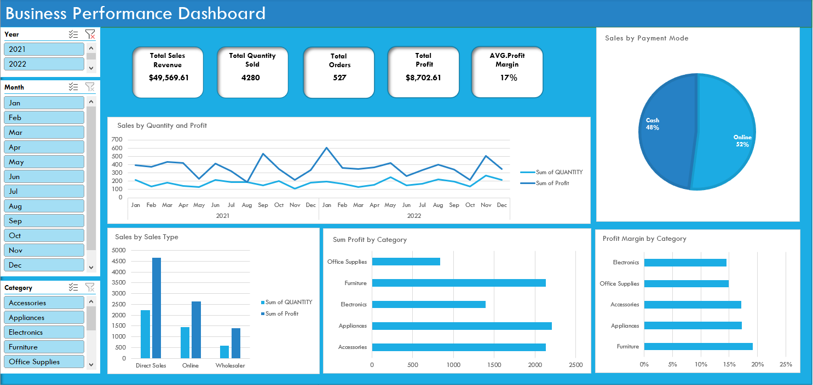

#  Excel Business Performance Dashboard



> An interactive, fully dynamic sales dashboard built entirely in Microsoft Excel — designed to turn raw business data into clear, actionable insights.

---

## Project Overview

This project is a **Business Performance Dashboard** built from scratch using Microsoft Excel. It covers two years of sales data (2021–2022) across multiple product categories, payment modes, and sales channels — giving stakeholders a 360° view of business health without leaving their spreadsheet.

The dashboard was built using Microsoft Excel to transform raw sales data into interactive visual insights that support business decision-making.

---

##  Business Problem

Raw sales data is only useful if someone can read it. Most businesses sit on months of transaction records with no way to quickly answer questions like:

* Which product category drives the most profit?
* How does performance compare month-over-month?
* Where are we losing margin?

This dashboard was built to answer exactly those questions — fast.

---

##  Objectives

* Clean and structure messy raw data for reliable analysis
* Build a scalable data model using Pivot Tables
* Design an interactive dashboard that non-technical stakeholders can actually use
* Surface the KPIs that matter most for business decision-making

---

##  Dashboard Features

| Feature                   | Description                                             |
| ------------------------- | ------------------------------------------------------- |
|  **Slicers**            | Filter by Year, Month, and Product Category dynamically |
|  **Trend Chart**        | Sales Quantity & Profit over time (Jan 2021 – Dec 2022) |
|  **Payment Mode**       | Cash vs. Online split (Pie Chart)                       |
|  **Sales by Channel**   | Direct Sales, Online, Wholesaler (Bar Chart)            |
|  **Profit by Category** | Compare profit across all 5 categories                  |
|  **Margin by Category** | Visualize profitability efficiency per category         |

---

## 📌 KPIs Tracked

| KPI                     | What It Tells You                            |
| ----------------------- | -------------------------------------------- |
| **Total Sales Revenue** | Overall income generated across all channels |
| **Total Quantity Sold** | Volume of units moved                        |
| **Total Orders**        | Number of distinct transactions              |
| **Total Profit**        | Net earnings after cost                      |
| **AVG Profit Margin**   | Profitability efficiency as a percentage     |

> KPI Cards are powered by **GETPIVOTDATA** formulas — they update automatically when slicers are applied.

---

##  Tools & Excel Skills Used

* **Power Query** — Data cleaning, transformation, and shaping
* **Pivot Tables** — Flexible data aggregation and modeling
* **Pivot Charts** — Dynamic visual representations tied to Pivot Tables
* **Slicers** — Cross-filtering across all dashboard components
* **GETPIVOTDATA** — Live KPI card formulas
* **Excel Formatting** — Dashboard layout, color theming, and UX design

---

## 💡 Key Business Insights

* **Furniture** leads in total profit, while **Electronics** holds the highest profit margin — two different stories from the same dataset
* **Online payments** (52%) slightly outpace Cash (48%), suggesting a shift in customer payment behavior
* **Direct Sales** channel dominates in quantity but wholesaler margins deserve a closer look
* Profit dips noticeably in certain months — a pattern worth investigating further for seasonal planning

---

## 📚 What I Learned

Building this dashboard from raw data to finished product taught me that **data cleaning takes longer than analysis** — and that's actually the point. Power Query removed the guesswork. Pivot Tables made the model flexible. But the real challenge was designing something that a non-analyst could open and immediately understand.

That gap between *technically correct* and *genuinely useful* is what this project pushed me to close.

---

##  Project Structure

```text
 Excel-Sales-Dashboard/
├──  Business_Performance_Dashboard.xlsx   # Main dashboard file
├──  Raw_Data.xlsx                         # Original dataset (pre-cleaning)
├──  dashboard-preview.png                 # Dashboard screenshot
└──  README.md                             # You're here
```

---

##  Future Improvements

* [ ] Migrate to **Power BI** for web sharing and richer visuals
* [ ] Add a **profitability forecasting** section using Excel trend lines
* [ ] Introduce **conditional formatting** alerts for underperforming categories
* [ ] Connect to a **live data source** via Power Query for real-time refresh

---

##  Let's Connect

If you're a recruiter, hiring manager, or fellow analyst — I'd love your feedback.

## 🤝 Let's Connect

If you're a recruiter, hiring manager, or fellow analyst — I'd love your feedback.

[](https://www.linkedin.com/in/engy-sayed/)
[](https://github.com/EngySayed)

---

*Built with 💙 using Microsoft Excel | Part of my Data Analytics Portfolio*
